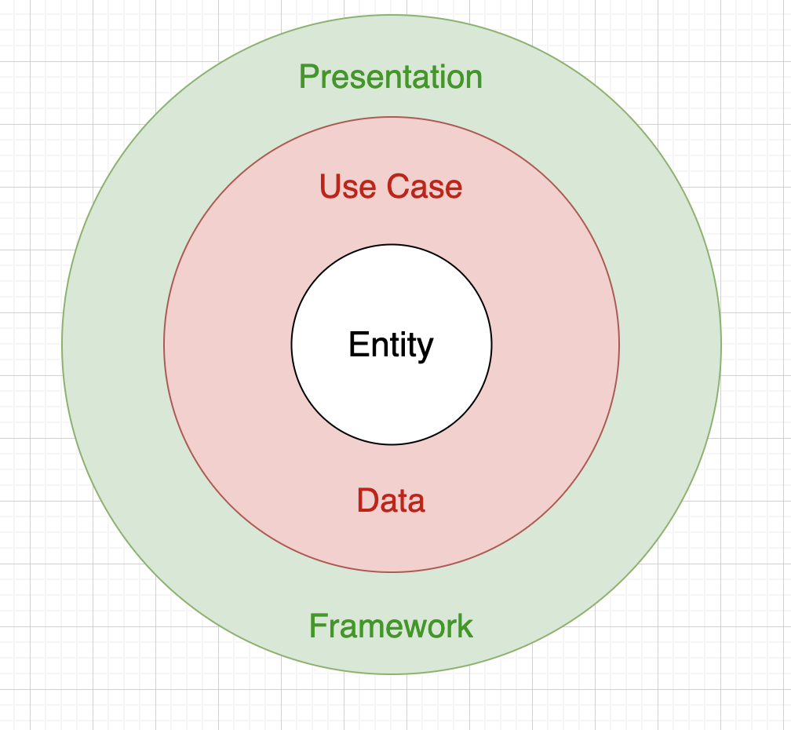

## 1. 애플리케이션 설계란?

애플리케이션 설계는 구성 요소들 사이에서 유기적 관계를 표현하고, 요구 사항을 해결하려는 계획 과정 등의 원칙을 나타냄.

잘 설계된 애플리케이션은 유지 보수비를 줄여 주고, 성능, 보안, 안정성 등의 측면에서 많은 이점이 있다.


---


## 2.애플리 케이션의 설계 원칙

### SOLID 원칙 - 2000년대 초반 로버트 C. 마틴이 소개한 OOP 및 설계에 대한 5가지 원칙


- ### 단일 책임 원칙(Single Responsibility Principle)

  - 모든 클래스는 하나의 책임만 가지며, 클래스는 그 책임을 완전이 캡슐화 해야한다는 원칙

    단일책임은 어떤 클래스나 모듈, 메서드가 단 하나의 기능을 가져야한다는 뜻. 

    변경사항이 발생 하더라도 그 변경 사항에 대한 책임이 있는 부분만 수정하면 된다.


- ### 개방-폐쇄 원칙(Open Closed Principle)

  - 소프트웨어가 확장에 대해서는 열려 있어야 하고, 수정에 대해서는 닫혀 있어야 한다는 원칙

    시스템의 구조를 올바르게 구성하여 변경 사항이 발생하더라도 다른 코드나 모듈에 영향이 없도록 하는 것

    OOP 의 핵심 원칙이라고 할 수 있다. 이 원칙을 따르지 않고도 객체 지향 언어 구현이 불가능 한 것은 아니지만 OOP 의 가장 큰 장점인 유연성, 재사용성, 유지 보수성 등을 결코 얻을 수 없게 된다.


- ### 리스코프 치환 원칙(Liskov Substitution Principle)

  - 클래스 S 가 클래스 T 의 자식 클래스 라면 별다른 변경 없이 T 를 S로 치환할 수 있어야 한다는 원칙

    다운 캐스팅된 인스턴스가 논리적으로 그 역할이 문제 없어야 한다

  - 리스코프 원칙은 OOP 특징에 관한 몇 가지 표준적인 요구사항을 강제한다.

    - 하위 클래스에서 메서드 파라미터의 반공변성
    - 하위 클래스에서 반환형의 공변성
    - 하위 클래스에서 메서드는 상위 클래스 메서드에서 던져진 예외 사항을 제외 하고 새로운 예외 사항을 던지면 안됨
    - 하위 클래스에서 선행 조건은 강화될 수 없음
    - 하위 클래스에서 후행 조건은 약화할 수 없음
    - 하휘형에서 상위형의 불변 조건은 반드시 유지되어야함

  - 다음 과 같이 차례로 상속 받는 타입이 있다고 가정 `A <= B <= C`

    ```java
    public class A()
    public class B extends A {}
    public class C extends B {}
    ```

    공변성 : List<? extends B> 란 B 를 상속 받는 타입으로 이루어진 리스트가 있다면 List<_C>를 사용할 수 있다는 내용

    반공변성 : List<? extends B> 란 리스트가 있을 때 List<A> 를 사용할 수 있다는 것. 물론 A의 부모 타입으로도 치환이 가능

    불변성  :위의 공변성과 반공변성을 허용하지 않는 경우


- ### 인터페이스 분리원칙(Interface Segregation Principle)

  - 어떠한 클래스가 자신이 이용하지 않는 메서드에 의존하지 않아야 한다는 원칙. 

    해당 원칙은 큰 덩어리의 인터페이스들을 구체적이고 작은 단위들로 분리함으로써 클래스들이 꼭 필요한 메서드들만 이용할 수 있게 한다. 이와 같은 작은 단위들을 역할 인터페이스 라고 부른다. 원칙을 통해 시스템의 내부 의존성을 약화해 리팩토링, 수정, 재배포를 쉽게 할 수 있다.


- ### 의존 역전 원칙(Dependency Inversion Prinsiple)

  - 모듈들을 분리하는 특정 형식을 지칭. 상위 계층이 하위 계층에 의존하는 전통적인 의존 관례를 역전시킴으로써 상위 계층이 하위 계층의 구현으로부터 독립되게 할 수 있다.
    1. 상위 모듈은 하위 모듈에 의존해서는 안 된다. 상위 모듈과 하위 모듈 모두 추상화에 의존해야 한다.
    2. 추상화는 세부 사항에 의존해서는 안 된다. 세부사항이 추상화에 의존해야한다.


---


## 3. 클린 아키텍처



> 원 바깥에서 원 안으로 들어갈수록 추상화 수준이 높아진다. [<이미지 출처>](http://icedtealabs.com/android/2020-android-clean-architecture.html)


클린 아키텍처는 로버트 C. 마틴에 의해 만들어진 철학으로, 소프트웨어의 관심사를 계층별로 분리하는 소프트웨어 디자인 철학이다. 주요 원칙은 코드 종속성이 외부로부터 내부로 의존한다는 것이다.

내부 계층의 코드는 외부 계층의 기능을 알 수 없다. 외부 계층에 존재하는 모든 엔티티는 안쪽 계층에서 다시 등장할 수 없다.

데이터 형식도 계층 간에 별도로 유지하는 것이 좋다. 

 :arrow_right: **내부 계층은 외부 계층을 알면 안된다.**(안쪽 계층으로 진입할수록 추상화와 캡슐화 수준이 높다진다.)

클린 아키텍처를 사용했을 때의 장점 : 코드의 재사용성이 용이, 유닛 테스트가 쉬워진다는 것.


### Entities

전사적 비즈니스 규칙을 캡슐화한다. 데이터의 구조나 메서드를 포함하는 객체. 

전사적으로 많은 다른 애플리케이션 사이에서 사용될 수 있다. 외부에서 무언가 변경 되었을 때 가장 최소한의 변경 사항을 가져야만한다. 예를 들어 화면의 이동, 보안과 관련된 내용 등이 변경되었을 때도 엔티티 계층은 영향을 받으면 안된다.


### Use Cases

애플리케이션과 관련된 비즈니스 규칙을 포함하고, 시스템의 모든 유스 케이스 구현체들을 캡슐화한다.

이러한 유스 케이스들은 엔티티로부터 데이터의 흐름들을 관리하고, 목적을 달성하도록 엔티티에 넓고 전사적인 비즈니스 규칙의 사용을 가르친다.

안드로이드에서는 Model, Repository, Executor 등과 관련된 내용이 이 계층에 속할 수 있다.

- Model : 데이터베이스의 질의나 네트워크 요청 등의 비즈니스 로직을 수행한다.
- Repository : 내부 DB에 접근하거나 저장 또는 원격 서버의 테이터를 요청하는 역할. 일반적으로 인터페이스이고 인터페이스를 구현하여 외부 계층의 연결을 느슨하게한다.
- Executor : Repository나 Model과 관련된 작업이 백그라운드에서 작업을 수행할 수 있도록 작업 스레드를 관리하고 제공


### Interface Adapters

use case 나 entity 로 부터 얻은 데이터를 가공하는 계층. 비즈니스 로직을 수행하여 원하는 결과 값을 얻어 UI에 표현하려고 적당한 형식으로 데이터를 변경하며, 흔히 말하는 Presenter, View, ViewModel, Controller 같은 관심사가 여기에 속함

목적은 비즈니스 로직과 프레임 워크 코드를 자연스럽게 연결하는 것 이다.


### Frameworks & Drivers

가장 바깥쪽 계층으로 일반적으로 안드로이드 에서는 UI 와 관련된 액티빝, 프래그먼트, 인텐트 전달 그리고 데이터에 접근하고 저장하는 데이터베이스, 콘텐츠 프로바이더가 포함되며, 마지막으로 네트워크 관련된 프레임 워크 코드가 이곳에 속한다.


**클린 아키텍처는 SOLID 원칙을 잘 따를 일종의 모범 패턴이다.** 

**정답은 따로 존재하지 않다고 생각한다(필자 왈) 상황에 따라 조금씩 다른 형태를 가질 수 있으나, 원칙은 변하지 않는다.**


---


## 4. 안드로이드의 특징

하나의 진입점, 하나의 프로세스에서 실행되는 일반적인 애플리케이션과 달리 안드로이드 애플리케이션은 다양한 컴포넌트로 구성되며, 여러 프로세스로 실행될 수 있고, 진입점 또한 다양하다.

안드로이드 컴포넌트는 언제든지 실행되고, 여러 시스템 조건으로 인해 의도치 않게 종료될 수 있다. 이러한 컴포넌트의 생명 주기는 개발자가 직접 제어하는 것이 아닌 안드로이드 시스템이 제어하기 떄문에 데이터 및 상태에 대한 내용을 컴포넌트에 저장하는 것은 위험하다.


---


## 5. 안드로이드 애플리케이션 설계 원칙

가장 중요한 원칙은 관심사 분리다.

 애플리케이션을 구별된 부분으로 분리하는 디자인 원칙으로 각 부분은 개개의 고나심사를 해결한다. 관심사란 어떠한 상태나 데이터에 영향을 미치는 정보의 집합이다. SOLID 원칙과도 많은 부분이 부합되며, 결국 관심사 분리라는 것은 클래스 간의 강한 의존성을 느슨하게 하면서 모듈화 시킨다. 모듈이란 것은 다른 모듈로부터 독립적이며 영역에 따라 다른 역할을 한다는 의미이다. 이렇게 관심사 분리를 통해 모듈화를 성공적으로 마치면 애플리케이션의 설계, 배포, 유닛 테스트와 같은 일부의 관점에서 더 높은 자유도가 생긴다.

관심사의 분리는 추상화의 일종이다. 대부분의 추상화에서처럼 인터페이스의 추가는 필수이며 실행에 쓰이는 더 순수한 코드가 있는 것이 일반적이다.


---


## 6. 권장하는 애플리케이션 설계


> 구글에서 권장하는 안드로이드 설계 다이어그램 [<이미지 출처>](https://developer.android.com/jetpack/guide?hl=ko)

- 액티비티 또는 프래그 먼트는 단지 ViewModel 만을 참조한다. ViewModel만 참조하여 ViewModel에서 하위 계층의 의존성이 어떻게 변경되든 Activity 나 Fragment 는 관심이 없다.
- ViewModel은 Repository라는 저장소를 참조하고 이 저장소로부터 UI 컴포넌트가 화면을 구성하는 데 필요한 데이터를 불러온다. 데이터를 불러와 LiveData라는 데이터의 변화를 감지할 수 있는 형태로 관리한다.
- 저장소는 두가지 타입의 모델을 참조하는데, 한가지는 네트워크 연결이 필요없는 내부 모델이고, 다른 하나는 우리가 일반적으로 서버에서 데이터를 불러오는 네트워크가 필요한 원격 모델이다.


- ViewModel 이라는 것은 내부 데이터베이스만을 항상 참조하고, 클라이언트의 데이터 베이스와 서버의 데이터 베이스가 요청으로 비동기적으로 동기화 한다. 이렇게 되면 오프라인 또는 느린 네트워크 상황에서도 애플리케이션은 원활히 동작할 수 있고, 네트워크 상황이 종하지는 대로 다시 최신의 데이터로 UI 컴포넌트를 갱신할 수 있다.


---


## 7.안드로이드 애플리케이션 설계 패턴


- MVC, MVP, MVVM 에 대한 설명이 나와있으나 기존에 다른 곳에 정리를 해두어서 생략한다.
- MVVM - https://jjjoonngg.github.io/android/7/ , https://jjjoonngg.github.io/android%20architecture/MVVM/
- MVP - https://jjjoonngg.github.io/android/10/