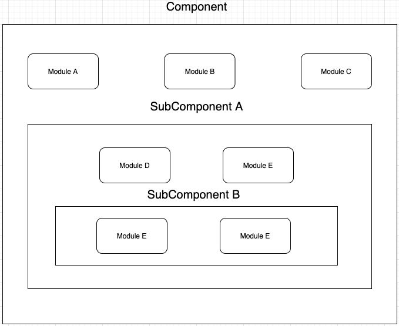
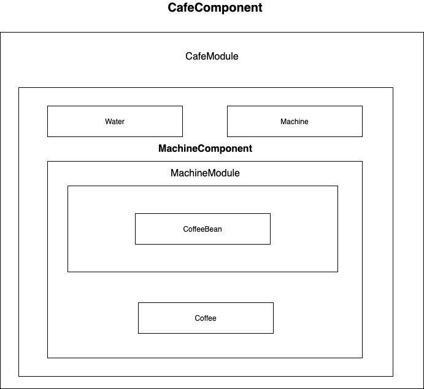

## 13. 컴포넌트 간의 의존 관계

Dagger에서는 컴포넌트 간의 의존 관계를 맺는 데 서브 컴포넌트와 컴포넌트 상속 두 가지 방법을 제공한다.


### 서브 컴포넌트

두 개의 컴포넌트를 연관 짓는 가장 쉬운 방법은 서브 컴포넌트를 선언하는 것

- 컴포넌트와 아주 비슷한 방식으로 동작하지만 상위 컴포넌트 내에 구현된다는 점에서 일반 컴포넌트와 다름

- 상위 컴포넌트는 컴포넌트가 될 수도 있고, 서브 컴포넌트가 될 수도 있다.
- 상위 컴포넌트의 바인딩된 모든 의존성을 제공 받지만 상위가 하위의 의존성을 제공받을 순 없음




> 애플리케이션 컴포넌트의 오브젝트 그래프 예시

서브 컴포넌트 B 는 서브 컴포넌트 A와 컴포넌트가 가진 모듈로부터 의존성을 제공 받을 수 있음

서브 컴포넌트 A는 컴포넌트의 모듈로 부터 의존성을 제공 받을 수 있지만 서브 컴포넌트 B의 의존성은 제공받지 못함

**컴포넌트는 서브 컴포넌트들이 가진 의존성을 제공받을 수 없음**


### 서브 컴포넌트 정의

 `@SubComponent` 를 붙이는 것으로 정의할 수 있음. modules 에 바인딩 하려는 속성의 모듈 클래스 들을 추가해야함

서브 컴포넌트를 만들려면 빌더 또는 팩토리를 반드시 정의해야한다.


> 서브 컴포넌트의 개념을 이용한 예제 - 정의

```kotlin
@Subcomponent(modules = [MachineModule::class])
interface MachineComponent {

    fun getCoffee(): Coffee
    fun inject(machine: Machine)

    @Subcomponent.Builder
    interface Builder {
        fun setMachineModule(coffeeMachineModule: MachineModule): Builder
        fun build(): MachineComponent
    }
}

```

```kotlin
class Coffee @Inject constructor(coffeeBean: CoffeeBean, water: Water) {}

class CoffeeBean {}

class Water {}
```

```kotlin
class Machine(builder: MachineComponent.Builder) {

    private val component: MachineComponent = builder.setMachineModule(MachineModule()).build()

    init {
        component.inject(this)
    }

    fun extract() = component.getCoffee()
}
```

```kotlin
@Module
class MachineModule {
    @Provides
    fun provideCoffeeBean() = CoffeeBean()
}
```


### 서브 컴포넌트 추가

서브 컴포넌트가 정의 됐으니 컴포넌트에 서브 컴포넌트로 추가해야한다. 컴포넌트에 서브 컴포넌트를 추가하려면 컴포넌트가 가진 `@Module` 의 멤버인 subcomponents 에 서브 컴포넌트 클래스를 추가 해야함. 서브 컴포넌트가 연결됐다면, 연결된 컴포넌트 모듈로부터 서브 컴포넌트의 빌더를 요청 할 수 있다.

```kotlin
@Component(modules = [CafeModule::class])
interface CafeComponent {
    fun inject(cafe: Cafe)
}
```

```kotlin
class Cafe {
    @Inject
    lateinit var coffeeMachine: Machine

    init {
        DaggerCafeComponent.create().inject(this)
    }

    fun orderCoffee() = coffeeMachine.extract()
}
```

```kotlin
@Module(subcomponents = [MachineComponent::class])
class CafeModule {

    @Provides
    fun provideWater() = Water()

    @Provides
    fun provideMachine(builder: MachineComponent.Builder) = Machine(builder)
}
```


컴포넌트에 연결 된 CafeModule로 부터 Machine 을 제공받을 수 있게 되었고, Machine의 생성자 매개 변수로는 서브 컴포넌트로부터 빌더를 제공받아 객체를 생성하는 것을 확인 할 수 있다.

> 커피 주문!

```kotlin
class CoffeeUnitTest {
    @Test
    fun testCafe(){
        val cafe = Cafe()
        println(cafe.orderCoffee())
        println(cafe.orderCoffee())
        println(cafe.orderCoffee())
    }
}

/*
결과
kr.co.jjjoonngg.dagger_sample_project.subcomponentexample.Coffee@1175e2db
kr.co.jjjoonngg.dagger_sample_project.subcomponentexample.Coffee@36aa7bc2
kr.co.jjjoonngg.dagger_sample_project.subcomponentexample.Coffee@76ccd017
 */
```


### 서브 컴포넌트의 특징

위의 예제의 관계를 오브젝트 그래프로 살펴본다



MachineComponent는 CafeComponent의 일부분으로 CafeComponent가 가진 CafeModule로부터 모듈이 가진 의존성을 제공받을 수 있지만, CafeComponent는 MachineComponent.Builder를 제외하고는 서브 컴포넌트가 가진 모듈의 의존성을 제공 받을 수 없다.


**서브 컴포넌트는 독립적인 생명 주기를 가진다. 컴포넌트가 존재하는 동안 서브 컴포넌트는 생성과 소멸을 반복할 수 있는 것이 특징이다. 컴포넌트가 소멸하면 서브 컴포넌트도 같이 소멸한다.**


### 컴포넌트의 상속

서브 컴포넌트는 오브젝트 그래프 내의 하위 그래프를 작성하는 가장 간단한 방법이지만 서브 컴포넌트는 부모 컴포넌트와 밀접하게 연결되어 분리가 어렵다. 그에 대안으로 컴포넌트의 상속이 있다(컴포넌트가 다른 컴포넌트를 상속하는 방법)

`@Component` 애노테이션의 dependencies 속성에 상속하려는 컴포넌트의 클래스를 추가하면 된다. 상속한 컴포넌트의 의존성을 사용하려면 상속한 컴포넌트가 해당 의존성을 프로비전 메서드로 반드시 제공해야한다.


```kotlin
@Component(modules = [ModuleAForComponentInheritance::class])
interface ComponentAForComponentInheritance {
    fun provideString(): String //프로비전 메서드
}
```

```kotlin
@Module
class ModuleAForComponentInheritance {
    @Provides
    fun provideString() = "String from ModuleA"
}
```

```kotlin
@Component(
    modules = [ModuleBForComponentInheritance::class],
    dependencies = [ComponentAForComponentInheritance::class]
)
interface ComponentBForComponentInheritance {
    fun inject(foo: FooForComponentInheritance)
}
```

```kotlin
@Module
class ModuleBForComponentInheritance {
    @Provides
    fun provideInteger() = 100
}
```

```kotlin
class FooForComponentInheritance {
    @Inject
    lateinit var str: String

    @set: [Inject Named("int")]
    var int: Int? = null
}
```

각각의 컴포넌트는 서로 다른 모듈에 의존, ComponentB는 ComponentA 를 상속하는 모습 

ComponentA의 프로비전 메서드로 provideString을 선언하였으므로, ComponentB는 ComponentA로부터 String 타입의 의존성을 제공받을 수 있다.


```kotlin
class ComponentInheritanceUnitTest {

    @Test
    fun testDependency() {
        val foo = FooForComponentInheritance()
        val componentA = DaggerComponentAForComponentInheritance.create()
        val componentB = DaggerComponentBForComponentInheritance.builder()
            .componentAForComponentInheritance(componentA)
            .build()
        componentB.inject(foo)
        println(foo.str)
        println(foo.int)
    }
    /*
    결과
    String from ModuleA
    100
     */
}

```


---

