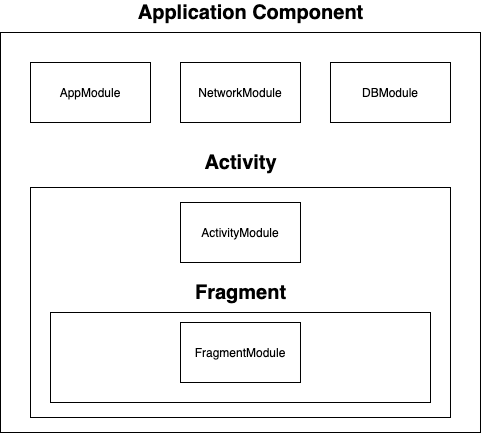

## 14. 안드로이드와 Dagger2


### 안드로이드를 위한 기본적인 접근 방식

안드로이드에 Dagger를 사용하려면 안드로이드의 다음 특성에 대해 먼저 이해해야한다.

- 안드로이드는 하나의 애플리케이션 내에서 액티비티 또는 서비스 같은 생명 주기를 갖는 컴포넌트로 구성됨
- 프래그먼트는 단독으로 존재할 수 없으며, 반드시 액티비티 내에 존재
- 애플리케이션을 포함한 액티비티 또는 서비스와 같은 컴포넌트는 시스템에 의해서만 인스턴스화


이 세 가지 특성을 중점으로 고려하여 컴포넌트 그래프를 만들면 다음과 같은 형태를 띈다.




애플리케이션의 생명 주기 동안 다양한 액티비티 및 서비스가 생성과 소멸을 반복할 수 있고, 하나의 액티비티 내에서는 마찬가지로 여러 프래그먼드트가 생성과 소멸을 반복할 수 있다. 

가장 큰 범위인 애플리케이션에서 일어나는 일들이므로 애플리케이션 생명 주기와 Dagger 컴포넌트 생명 주기를 같이 하는 애플리케이션 컴포넌트를 만든다.

액티비티 or 서비스를 위한 컴포넌트는 애플리케이션 컴포넌트에 서브 컴포넌트로 구성, 프래그먼트는 액티비티 컴포넌트의 서브 컴포넌트로 재지정한다.


```kotlin
@Component(modules = [AppModule::class])
@Singleton
interface AppComponent {
    fun mainActivityComponentBuilder(): MainActivityComponent.Builder
    fun inject(app: App)

    @Component.Factory
    interface Factory {
        fun create(@BindsInstance app: App, appModule: AppModule): AppComponent
    }
}
```

> 애플리케이션 컴포넌트 생성을 위한 AppComponent 코드

```kotlin
@Module(subcomponents = [MainActivityComponent::class])
class AppModule {

    @Provides
    @Singleton
    fun provideSharedPreferences(app: App) =
        app.getSharedPreferences("default", Context.MODE_PRIVATE)
}
```

AppComponent는 빌더 또는 팩토리를 통해 생성된다. 팩토리에서 create 메서드의 매개 변수로 애플리케이션 컴포넌트의 모듈로 AppModule과 애플리케이션 클래스인 App 을 받는다.


```kotlin
class App : Application() {

    private lateinit var appComponent: AppComponent

    override fun onCreate() {
        super.onCreate()
        appComponent = DaggerAppComponent.factory()
            .create(this, AppModule())
    }

    fun getAppComponent() = appComponent
}
```

> App 클래스를 매니페스트에 등록해야만한다.

애플리케이션 인스턴스는 시스템에 의해서만 생성될 수 있어 애플리케이션이 생성된 후 팩토리의 `@BindsInstance` 메서드를 통해 오브젝트 그래프에 바인딩한다.


AppModule에서는 애플리케이션의 생명 주기 동안 싱글턴으로 취급할 SharedPreference를 제공하며, 싱글턴이 아닌 매번 인스턴스를 생성하거나 시스템으로부터 가져오고 싶다면 `@Singleton` 메서드를 제거하면 됨


액티비티를 위한 컴포넌트는 서브 컴포넌트로 구성해야하므로 서브 컴포넌트의 클래스를 애플리케이션 모듈의 멤버로 추가했다.

각 서브 컴포넌트와 빌더가 정의 되었다면 컴포넌트에서는 서브 컴포넌트의 빌더를 반환하는 프로비전 메서드를 가질 수 있다.


> MainActivity를 위한 서브 컴포넌트 클래스

```kotlin
@Subcomponent(modules = [MainActivityModule::class])
interface MainActivityComponent {
    fun mainFragmentComponentBuilder(): MainFragmentComponent.Builder

    fun inject(activity: MainActivity)

    @Subcomponent.Builder
    interface Builder {
        fun setModule(module: MainActivityModule): Builder

        @BindsInstance
        fun setActivity(activity: MainActivity): Builder
        fun build(): MainActivityComponent
    }
}
```

```kotlin
@Module(subcomponents = [MainFragmentComponent::class])
class MainActivityModule {
    @Provides
    fun provideActivityName() = MainActivity::class.simpleName ?: "Failed get Activity Simple Name"

}
```

애플리케이션과 마찬가지로 액티비티 인스턴스 또한 시스템에 의애서 생성 되므로 액티비티의 생명 주기 콜백 내에서 서브 컴포넌트 빌드 시 바인딩할 수 있도록 `@BindsInstacne` 세터 메서드를 통해 액티비티 인스턴스를 바인딩

액티비티를 위한 컴포넌트 모듈에서는 프래그 먼트를 위한 서브 컴포넌트를 추가


```kotlin
class MainActivity : AppCompatActivity() {

    @Inject
    lateinit var sharedPreferences: SharedPreferences

    @Inject
    lateinit var activityName: String

    private lateinit var component: MainActivityComponent


    override fun onCreate(savedInstanceState: Bundle?) {
        super.onCreate(savedInstanceState)
        setContentView(R.layout.activity_main)

        component = App().getAppComponent()
            .mainActivityComponentBuilder()
            .setModule(MainActivityModule())
            .setActivity(this)
            .build()

        component.inject(this)

        supportFragmentManager.beginTransaction()
            .replace(R.id.container, MainFragment())
            .commit()
    }

    fun getComponent() = component
}
```

> activity_main.xml

```xml
<?xml version="1.0" encoding="utf-8"?>
<androidx.constraintlayout.widget.ConstraintLayout xmlns:android="http://schemas.android.com/apk/res/android"
    xmlns:app="http://schemas.android.com/apk/res-auto"
    xmlns:tools="http://schemas.android.com/tools"
    android:layout_width="match_parent"
    android:layout_height="match_parent"
    tools:context=".main.MainActivity">

    <FrameLayout
        android:id="@+id/container"
        android:layout_width="0dp"
        android:layout_height="0dp"
        app:layout_constraintBottom_toBottomOf="parent"
        app:layout_constraintEnd_toEndOf="parent"
        app:layout_constraintStart_toStartOf="parent"
        app:layout_constraintTop_toTopOf="parent" />

</androidx.constraintlayout.widget.ConstraintLayout>
```

애플리케이션으로부터 AppComponent 인스턴스를 가져와서 MainActivityComponent.Builder를 제공받아 액티비티 모듀로가 인스턴스를 바인딩 하고 MainActivityComponent를 생성한 뒤 의존성을 주입하는 모습


프래그먼트도 액티비티와 동일하게 서브 컴포넌트를 정의한 후 프래그먼트 범위 내에서 의존성을 주입할 수 있다.

```kotlin
@Subcomponent(modules = [MainFragmentModule::class])
interface MainFragmentComponent {

    fun inject(mainFragment: MainFragment)

    @Subcomponent.Builder
    interface Builder {
        fun setModule(module: MainFragmentModule): MainFragmentComponent.Builder

        @BindsInstance
        fun setFragment(fragment: MainFragment): MainFragmentComponent.Builder
        fun build(): MainFragmentComponent
    }
}
```

```kotlin
@Module
class MainFragmentModule {
    @Provides
    fun provideInt() = Random().nextInt()
}

class MainFragment : Fragment() {
    @Inject
    lateinit var sharedPreferences: SharedPreferences

    @Inject
    lateinit var activityName: String

    @set: [Inject Named("int")]
    var randomNumber: Int? = null

    override fun onAttach(context: Context) {
        super.onAttach(context)
        if (activity is MainActivity) {
            (activity as MainActivity).getComponent()
                .mainFragmentComponentBuilder()
                .setModule(MainFragmentModule())
                .setFragment(this)
                .build()
                .inject(this)
        }

        Log.d("MainFragment", activityName)
        Log.d("MainFragment", "randomNumber = $randomNumber")
    }
}
```

```
결과
D/MainFragment: MainActivity
D/MainFragment: randomNumber = 1849952731
```


> 책에 나와있는 사용자 정의 Scope 는 따로 정의하지 않은 코드이며
>
> SharedPreference 는 존재하지 않으므로 해당 부분은 주석처리를 해야 프로젝트가 제대로 돌아간다


### 보일러 플레이트 코드 제거

#### android.dagger.* 패키지 활용하기

위에 작성 했던 코드들은 다음과 같은 문제점이 존재한다.

- 비슷한 형태의 반복되는 보일러 플레이트 코드들이 생성됨
- 리팩토링이 쉽지 않음
- 멤버 주입 메서드의 매개 변수로 정확한 타입을 알아야함

이러한 문제점들을 해결하도록 Dagger 에서는 안드로이드를 위한 dagger.android 패키지를 제공한다.

액티비티의 의존성을 주입한다고 가정하고 기존 코드를 다시 고쳐본다.


가장 먼저 해야 할 일은 AndroidInjectionModule을 추가하는 것 이다. AndroidInjectionModule에는 안드로이드 프레임 워크 관련 클래스에 의존성 주입을 위임할 AndroidInjector<?> 의 팩토리를 멀티 바인딩으로 구현한다.


>  AndroidInjectionModule과 AndroidInjector를 구현한 AppComponent

```kotlin
@Singleton
@Component(modules = [AppModule::class, AndroidInjectionModule::class])
interface AppComponent : AndroidInjector<App> {

    @Component.Factory
    interface Factory : AndroidInjector.Factory<App> {
    }
}
```

AndroidInjector는 멤버 인젝션을 위한 inject() 메서드가 포함되고, AndrodInjector.Fatory는 App 인스턴스를 그래프에 바인딩하고 Component를 반환하는 create() 메서드가 이미 포함되어 있으므로 별도로 정의할 필요는 없다.


AppModule에서는 MainActivity의 인스턴스에 멤버인젝션을 담당할 MainActivitySubComponent를 서브 컴포넌트로 연결한다.

```kotlin
@Module(subcomponents = [MainActivitySubcomponent::class])
abstract class AppModule {
    @Named("app")
    @Provides
    @Singleton
    fun provideString() = "String from AppModule"

    @Binds
    @IntoMap
    @ClassKey(MainActivity::class)
    abstract fun bindAndroidInjectorFactory(factory: MainActivitySubcomponent.Factory): AndroidInjector.Factory<*>

}
```

`@Singleton` 스코프에서 의존성을 주입하는지 확인하도록 문자열을 하나 반환하는 프로바이드 메서드를 정의


bindAndroidInjectorFactory 메서드는 AndroidInjectionModule 내부에 있는 Map 에 AndroidInjector.Facotry 를 멀티 바인딩한다. 이로써 서브 컴포넌트들이 편하게 멤버 인젝션을 할 수 있도록 인젝터 팩토리들을 멀티 바인딩으로 관리한다.


```kotlin
class App : Application() {

    @Inject
    lateinit var dispatchingAndroidInjector: DispatchingAndroidInjector<Any>

    override fun onCreate() {
        super.onCreate()
        DaggerAppComponent.factory()
            .create(this)
            .inject(this)
    }

    override fun androidInjector(): AndroidInjector<Any>? {
        return dispatchingAndroidInjector
    }
}
```


> MainActivity의 의존성 주입을 담당할 MainActivitySubcomponent와 MainActivityModule 을 다음과 같이 선언

```kotlin
@Subcomponent(modules = [MainActivityModule::class])
interface MainActivitySubcomponent : AndroidInjector<MainActivity> {
    @Subcomponent.Factory
    interface Factory : AndroidInjector.Factory<MainActivity> {}
}
```

```kotlin
@Module(subcomponents = [MainFragmentSubcomponent::class])
abstract class MainActivityModule {

    @Named("activity")
    @Provides
    fun provideString() = "String from MainActivityModule"

    @Binds
    @IntoMap
    @ClassKey(MainFragment::class)
    abstract fun bindInjectorFactory(factory: MainFragmentSubcomponent.Factory): AndroidInjector.Factory<*>

}
```


MainActivitySubcomponent가 서브 컴포넌트지만 자신의 하위에 다시 서브 컴포넌트를 가질 수 있음 

```kotlin
class MainActivity : AppCompatActivity(), HasAndroidInjector {

    @Inject
    lateinit var androidInjector: DispatchingAndroidInjector<Any>

    @Inject
    @Named("app")
    lateinit var appString: String

    @Inject
    @Named("activity")
    lateinit var activityString: String

    override fun onCreate(savedInstanceState: Bundle?) {
        AndroidInjection.inject(this)
        Log.e("MainActivity", appString)
        Log.e("MainActivity", activityString)
        super.onCreate(savedInstanceState)
        setContentView(R.layout.activity_main)
        supportFragmentManager.beginTransaction()
            .replace(R.id.container, MainFragment())
            .commit()
    }

    override fun androidInjector(): AndroidInjector<Any>? {
        return androidInjector
    }
}
```

AndroidInjection.inject()를 호출하면 App으로부터 `DispatchingAndroidInjector<Any>`를 얻고 이를 통해 MainActivity에 맞는 AndroidInjector.Facotry 를 클래스 이름을 통해서 찾음

팩토리를 통해 생성된 MainActivitySubcomponent 는 액티비티에서 호출한 inject() 를 통해 의존성 주입이 완료된다.


> 프래그먼트의 경우도 액티비티와 다르지 않음

```kotlin
@Subcomponent(modules = [MainFragmentModule::class])
interface MainFragmentSubcomponent : AndroidInjector<MainFragment> {

    @Subcomponent.Factory
    interface Factory : AndroidInjector.Factory<MainFragment> {}
}
```

```kotlin
@Module
class MainFragmentModule {

    @Named("fragment")
    @Provides
    fun provideString() = "String from fragment"
}
```

```kotlin
class MainFragment : Fragment() {

    @Inject
    @Named("app")
    lateinit var appString: String

    @Inject
    @Named("activity")
    lateinit var activityString: String

    @Inject
    @Named("fragment")
    lateinit var fragmentString: String

    override fun onAttach(context: Context) {
        AndroidSupportInjection.inject(this)
        Log.e("MainFragment", appString)
        Log.e("MainFragment", activityString)
        Log.e("MainFragment", fragmentString)
        super.onAttach(context)
    }
}
```

```
결과
E/MainActivity: String from AppModule
E/MainActivity: String from MainActivityModule
E/MainFragment: String from AppModule
E/MainFragment: String from MainActivityModule
E/MainFragment: String from fragment
```


### `@ContributesAndroidInjector` 애노테이션 활용하기

만약 서브 컴포넌트의 팩토리가 다른 메서드나 클래스를 상속하지 않는다면 `@ContributesAndroidInjector`를 활용해 서브 컴포넌트를 정의하는 코드를 대체함으로써 서브 컴포넌트를 위한 보일러 플레이트 코드를 더 줄일 수 있다.


> `@ContributesAndroidInjector` 애노티에션을 활용한 전체 소스 코드를 확인하고 앞에서 다룬 코드와의 차이를 확인해본다. 

```kotlin
@Module
abstract class AppModule {

    @ContributesAndroidInjector(modules = [MainActivityModule::class])
    abstract fun mainActivity(): MainActivity

    companion object {
        @Named("app")
        @Provides
        @Singleton
        fun provideString() = "String from AppModule"
    }
}
```

```kotlin
class App : DaggerApplication() {

    override fun applicationInjector(): AndroidInjector<out DaggerApplication> {
        return DaggerAppComponent.factory().create(this)
    }
}
```

```kotlin
@Module
abstract class MainActivityModule {

    @ContributesAndroidInjector(modules = [MainFragmentModule::class])
    abstract fun mainFragment(): MainFragment

    companion object {
        @Named("activity")
        @Provides
        fun provideString() = "String from MainActivityModule"
    }
}
```

```kotlin
class MainActivity : DaggerAppCompatActivity() {

    @Inject
    @Named("app")
    lateinit var appString: String

    @Inject
    @Named("activity")
    lateinit var activityString: String

    override fun onCreate(savedInstanceState: Bundle?) {
        AndroidInjection.inject(this)
        Log.e("MainActivity", appString)
        Log.e("MainActivity", activityString)
        super.onCreate(savedInstanceState)
        setContentView(R.layout.activity_main)
        supportFragmentManager.beginTransaction()
            .replace(R.id.container, MainFragment())
            .commit()
    }
}
```

```kotlin
class MainFragment : DaggerFragment() {

    @Inject
    @Named("app")
    lateinit var appString: String

    @Inject
    @Named("activity")
    lateinit var activityString: String

    @Inject
    @Named("fragment")
    lateinit var fragmentString: String

    override fun onAttach(context: Context) {
        AndroidSupportInjection.inject(this)
        Log.e("MainFragment", appString)
        Log.e("MainFragment", activityString)
        Log.e("MainFragment", fragmentString)
        super.onAttach(context)
    }
}
```


우선 서브 컴포넌트를 정의하던 코드들은 모두 제거하고 상위 컴포넌트의 `@ContributesAndroidInjector` 정의로 대체된 것을 확인할 수 있음

그 외에도 Application 대신 DaggerAppliation, AppCompatActivity 대신 DaggerAppCompatActivity, Fragment 대신 DaggerFragment 를 상속했다. Dagger 에서 제공하는 베이스 클래스를 상속함으로써 많은 보일러 플레이트 코드를 제거할 수 있다. 만약 베이스 클래스를 기존 프로젝트에 적용할 수 ㅇ없다면 베이스 클래스 내부를 참조하여 HasAndroidInjector 인터페이스를 직접 구현하면 된다.


### Dagger 베이스 클래스

DispatchingAndroidInjector는 AndroidInjector.Factory 를 런 타임에 찾도록 HasAndroidInjector를 구현하게 되고, 매번 액티비티 또는 프래그먼트 등에서 AndroidInjection.inject()를 호출 하는 것 또한 보일러-플레이트 코드 이므로 이를 구현할 Base 클래스를 작성할 수 있다. Dagger는 이를 기본적으로 android.dagger.package 에서 제공한다.


> DaggerAppliction.kt 예시

```kotlin
class App : DaggerApplication() {

    override fun applicationInjector(): AndroidInjector<out DaggerApplication> {
        return DaggerAppComponent.factory().create(this)
    }
}
```

DaggerApplication을 상속한 App 클래스를 작성하면 applicationInjector() 메서드를 구현해야 하는데, 이때 애플리케이션 컴포넌트를 반환시키는 코드를 작성하기만 하면 기존의 모든 코드를 대체할 수 있다.


> DaggerAppCompatActivity 를 상속한 MainActivity.kt 예시

```kotlin
class MainActivity : DaggerAppCompatActivity() {

    @Inject
    lateinit var sharedPreferences: SharedPreferences

    @Inject
    lateinit var activityName: String

    override fun onCreate(savedInstanceState: Bundle?) {
        super.onCreate(savedInstanceState)
        setContentView(R.layout.activity_main)
        
        supportFragmentManager.beginTransaction()
            .replace(R.id.container, MainFragment())
            .commit()
    }
}
```

다음과 같은 기본 framework type 을 지원한다.

- DaggerApplication
- DaggerActivity
- DaggerFragment
- DaggerService
- DaggerIntentService
- DaggerBroadcaseReceiver
  - 사용하는 경우 Androidmanifest.xml 에 브로드캐스트 리시버가 등록되어야하며 직접 리시버 인스턴스를 생성하는 경우 생성자 주입을 사용해야한다.
- DaggerContentProvider


---

