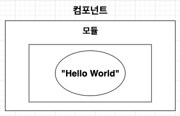

## 7. 컴포넌트

바인딩된 모듈로부터 오브젝트 그래프를 생성하는 핵심적인 역할을 한다.

`@Component` 사용을 통해 컴포넌트를 생성할 수 있으며, `@Component` 애노테이션은 interface 또는 abstract 클래스에만 붙일 수 있음 컴파일 타임의 애노테이션 프로세서에 의해 생성된 클래스는 접두어 'Dagger'와 `@Component` 가 붙은 클래스 이름이 합쳐진 형식의 이름을 가짐


`@Component` 속성으로 modules 와 dependencies가 있다.

- modules 
  - 컴포넌트에 바인드 되는 `@Module` 이 지정된 클래스 배열 선언
  - 모듈이 다른 모듈을 포함하는 경우 컴포넌트에 선언된 모듈 뿐만아니라 포함된 모듈도 컴포넌트에 구현될 수 있도록 해야함
- dependencies
  - 컴포넌트에 다른 컴포넌트의 의존성을 사용하는 경우 클래스 배열을 선언


#### 오브젝트 그래프

Dagger 에서 컴포넌트, 모듈, 객체등의 관계를 컨테이너 또는 오브젝트 그래프라고 함 (짧게는 그래프라고도한다.)

Hello World 예제에 대한 오브젝트를 다음과 같이 도식화 가능




#### 컴포넌트 메서드

`@Component` 가 붙은 모든 타입은 최소한 하나의 추상적인 메서드를 가져야함

메서드의 이름은 상관 없지만, 매개 변수와 반환형은 규칙을 엄격하게 따라야함

규칙에 따라 프로비전 메서드와 멤버-인젝션 메서드로 구분됨

- **프로비전 메서드(Provision methods)**

  - 매개 변수를 갖지 않으면서 반환형은 모듈로부터 제공되거나 주입되는 메서드

  ```kotlin
  @Component(modules = [SomeModule::class])
  interface SomeComponent{
  		fun getSomeType() : SomeType
  }
  ```

  `getSomeType()` 메서드를 호출하면 SomeModule로부터 제공받거나 주입받은 SomeType 객체를 반환


- **멤버-인젝션 메서드 (Member-injection methods)**

  - 하나의 매개 변수를 갖는 메서드
  - void를 반환하거나 빌더 패턴처럼 메서드 체이닝이 가능한 메서드를 만들기 위해 매개 변수 타입을 반환형으로 갖는 메서드로 선언 가능

  ```kotlin
  @Component(modules = [SomeModule::class])
  interface SomeComponent{
  		fun inejectSomeType(somType : SomeType)
  		
  		fun injectAndReturnSomeType(somType : SomeType) : SomeType
  }
  ```

  

  - Hellow World 예제를 조금 수정하여 멤버-인젝션 메서드를 구현

    - 의존성을 주입 받도록 MyClass 를 만듬 - 의존성 주입 받을 필드에 `@Inject` 애노테이션을 붙임

    ```kotlin
     class MyClass {
        @JvmField
        @Inject
        var str: String? = null
    }
    ```

    - MyComponent에도 다음과 같이 메서드 추가

    ```kotlin
    @Component(modules = [MyModule::class])
    interface MyComponent {
        fun inject(myClass: MyClass)
    }
    ```

    - 테스트

    ```kotlin
        @Test
        fun testMemberInjection() {
            val myClass = MyClass()
            var str = myClass.str
            println("조회 결과 $str")
            val myComponent = DaggerMyComponent.create()
            myComponent.inject(myClass)
            str = myClass.str
            assertEquals("hello world", str)
        }
    ```

    호출전에는 null 이었다가 호출 이후 "hello world" 가 주입된 것을 확인 할 수 있음

    멤버-인젝션 메서드에 의해 필드 주입이 일어난 결과

  - 매개 변수가 없고 MembersInjector를 반환하는 메서드를 추가한 뒤 테스트 해본다

    ```kotlin
        @Test
        fun testMemberInjector() {
            val myClass = MyClass()
            var str = myClass.str
            println("result = $str")
            val myComponent = DaggerMyComponent.create()
            val injector: MembersInjector<MyClass> = myComponent.getInjector()
            injector.injectMembers(myClass)
            str = myClass.str
            println("result = $str")
        }
    ```


#### 의존성 주입하기

Dagger에서는 3가지 의존성 주입 방법을 제공

- 필드 주입
- 생성자 주입
- 메서드 주입

`@Inject` 애노테이션이 붙은 필드, 메서드 또는 생성자에 인스턴스를 주입하는데, 실무에서는 필드주입과 생성자 주입이 주로 사용


간단한 예제를 통해 필드, 생성자, 메서드 주입을 살펴본다

```kotlin
@Component(modules = [PersonModule::class])
interface PersonComponent{

		fun getPersonA() : PersonA //프로비전 메서드
		
		fun inject(personB : PersonB) //멤버-인젝션 메서드
}
```

```kotlin
@Module
class PersonModule{
  
		@Provides
		fun provideNamde() = "Charles"
  
  	@Provides
  	fun provideAge() = 100
}
```

```kotlin
data class PeronA(
		val name : String
		val age : Int
){
	@Inject //생성자 주입
	PersonA(name:String, age :Int){
		this.name = name
		this.age = age
	}
}
```

```kotlin
class PersonB{
	@JvmField
	@Inject //필드 주입
	var name : String? = null
	
	private var age : Int? = null
	
	@Inject //메서드 주입
	fun setAge(age:Int){
		this.age = age
	}	
}
```

이름과 나이를 제공하는 PeronModule을 PersonComponent에 추가하고

PersonA 객체를 제공하는 프로비전 메서드와 PersonB에 멤버-인젝션을 하는 메서드 추가

- 생성자 주입 - PersonA
- 필드 주입 & 메서드 주입 동시수행 - PersonB

```kotlin
@Test
fun testInjection(){
	val personComponent = DaggerPersonComponent.create()
	
	val personA = personComponent.getPersonA()
	println("${personA.name} : ${personA.age}")
	
	val personB = PersonB()
	personComponent.inject(personB)
	println("${personB.name} : ${personB.age}")
}
```


#### 상속된 클래스에 의존성 주입

멤버-인젝션 메서드를 호출 시 매개 변수 타입에 서브 클래스의 객체를 넣으면 해당 슈퍼 클래스의 `@Inject` 멤버만 의존성 주입이 이루어짐

```kotlin
class Parent{
	@Inject
	var a : A? = null
}

class Self : Parent{
	@Inject
	var b : B? = null
}

class Child : Self{
	@Inject
	var c : C? = null
}
```

멤버-인젝션 메서드인 inject(Self) 가 존재하고, Child 의 인스턴스를 멤버-인젝션 메서드의 매개 변수로 참조하여 메서드를 호출하면 Child의 인스턴스에는 a와 b 만 주입되고 c 에는 주입되지 않는 것을 확인 할 수 있다.


#### 컴포넌트 객체 만들기

컴포넌트를 객체화할 때는 주로 생성된 빌더나 팩토리를 통해 만들 수 있다. 컴포넌트내의 `@Component.Builder` 또는 `@Component.Factory` 타입 선언을 통해 빌더 또는 팩토리가 생성되는데 애노테이션이 존재하지 않으면 Dagger 는 `@Component` 애노테이션에 선언된 모듈 및 의존성을 참조하여 빌더를 자동으로 생성한다.


빌더와 팩토리를 생성하는 규칙은 매우 엄격하며 다음과 같은 조건이 반드시 성립해야함

**컴포넌트 빌더를 만드는 조건**

- `@Component.Builder` 애노테이션은 컴포넌트 타입 내에 선언 되야 함
- 반드시 매개 변수를 갖지 않고, 컴포넌트 타입 또는 컴포넌트의 슈퍼 타입을 반환하는 추상 메서드를 하나 포함해야 함
  - 이를 **빌드 메서드 라고함(build method)**
- 빌드 메서드를 제외한 나머지는 세터 메서드(setter methods)라고 함
- `@Component` 애노테이션에 modules, dependencies 로 선언된 요소들은 세터 메서드로 선언해야 함
- 세터 메서드는 반드시 하나의 매개 변수만 가져야하고, 반환형으로는 void, 빌더 또는 빌더의 슈퍼 타입이 될 수 있음
- 세터 메서드에 `@BindInstance` 를 붙이면, 해당 컴포넌트에 인스턴스를 넘겨 바인드 시킴


**컴포넌트 팩토리를 만드는 조건**

- `@Component.Factory` 애노테이션은 컴포넌트 타입 내에 선언되야 함
- 컴포넌트 타입 또는 컴포넌트의 슈퍼 타입을 반환하는 하나의 추상 메서드만 존재 해야함 ex) newInstance(...)
- 팩토리 메서드에는 `@Component` 애노테이션에 modules, dependencies 로 지정된 속성들을 반드시 매개 변수로 가져야 함
- 메서드에 `@BindInstance` 애노테이션이 붙은 매개 변수는 해당 컴포넌트에 인스턴스를 넘겨 바인드 시킴
  - 생성되는 컴포넌트 타입에는 factory() 라는 정적 메서드를 갖는데 팩토리 인스턴스를 반환
  - 이 팩토리 인스턴스로 컴포넌트를 초기화 할 수 있다.