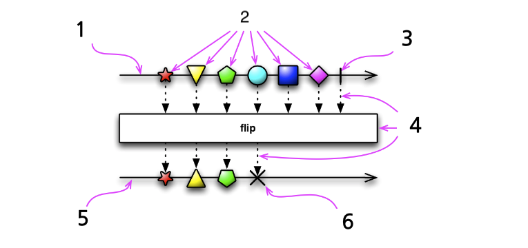

# 1. RxJava 란?

- ReactiveX(Reactive Extensions) 를 자바로 구현한 라이브러리

  ReactiveX는 MicroSoft사 주도 아래 옵서버 패턴, 이터레이터 패턴, 함수형 프로그래밍의 장점과 개념을 접목한 반응형 프로그래밍 기법을 의미.

- 이벤트 처리 및 비동기 처리의 구성에 최적화된 라이브러리

- Observable 추상화 및 관렬ㄴ 상위 함수에 중점을 둔 단일 JAR로 가벼운 라이브러리, 현재(2020.04 기준) Java 6 버전 이후부터 지원하며 java 이외에도 C++, Swift, C#, JavaScript 등 여러 언어를 지원한다.


### RxJava 설정하기

> 모듈 레벨의 build.gradle에 다음과 같은 내용 추가
>
> 최신 버전은 https://github.com/ReactiveX/RxJava 에서 확인가능

```
implementation "io.reactivex.rxjava3:rxjava:3.x.y"
implementation "io.reactivex.rxjava3:rxandroid:3.x.y"
```

RxAndroid는 RxJava에 Android용 스케쥴러 등 몇 가지 클래스를 추가해 안드로이드 개발을 쉽게 해주는 역할

새로운 버전의 배포가 드물지만 최신 버전의 RxJava 와 함께 사용하는 것을 권장


### Java 8 언어 기능 사용하기

android studio 3.0 이상에서는 플랫폼 버전에 따라 Java 8 언어 기능을 부분적으로 지원하지만, 람다식 및 메서드 참조 드의 기능은 모든 버전에서 호환됨.

> build.gradle (module) 에 추가

```
android{
		...
    compileOptions {
        sourceCompatibility JavaVersion.VERSION_1_8
        targetCompatibility JavaVersion.VERSION_1_8
    }
    //코틀린 프로젝트라면 아래 내용도 추가
    kotlinOptions {
        jvmTarget = "1.8"
    }
}
```


### 반응형 프로그래밍이란?

- 주변 환경과 끊임없이 상호작용을 하는 프로그래밍

- 프로그램이 주도하는 것이 아닌 환경이 변하면 이벤트를 받아 동작하도록 만드는 프로그래밍 기법

- 외부 요구에 끊임없이 반응하고 처리


### 명령형 프로그래밍과 반응형 프로그래밍의 차이

명령형 프로그래밍 

- 작성된 코드가 정해진 순서대로 실행되는 방식의 프로그래밍
- 코드가 순서대로(Statement by statement) 실행되므로 개념적으로 친밀하고, 직접적으로 구체화하여 이해하기 쉬움
- '코드가 순서대로 실행된다'의 의미는 조건문, 반복문, 또는 함수 호출 등에 의해 컴파일러가 다른코드로 이동하는 것
- 디버거 코드의 명령문을 명확하게 가리킬 수 있고 다음 코드 라인이 무엇인지 명확하게 알 수 있음

```kotlin
@Test
fun imperativeProgramming() {
    val items = ArrayList<Int>()
    items.add(1)
    items.add(2)
    items.add(3)
    items.add(4)

    //Print Even Number
    for (item in items) {
        if (item % 2 == 0) {
            println(item)
        }
    }

    /*
    결과
    2
    4
    */
  
    items.add(5)
    items.add(6)
    items.add(7)
    items.add(8)
}
```

- 다음과 같이 정리 할 수 있다
  - 리스트를 만든다
  - 리스트에 1부터 4까지 아이템을 순차적으로 추가한다.
  - items 라는 리스트를 순회하며, 짝수를 출력
  - 리스트에 5부터 8까지 아이템을 순차적으로 추가한다.


출력 명령 이후 리스트에 아이템을 추가해도 콘솔에는 영향을 끼치지 않는다.


반응형 프로그래밍

- 시간순으로 들어오는 모든 데이터의 흐름을 스트림으로 처리
- 하나의 데이터의 흐름은 다른 데이터 흐름으로 변형되기도 하고, 여러 데이터 흐름이 하나의 데이터 흐름으로 변경 될 수 있음

```kotlin
@Test
fun reactiveProgramming() {
    val items: PublishSubject<Int> = PublishSubject.create()
    items.onNext(1)
    items.onNext(2)
    items.onNext(3)
    items.onNext(4)
    //Print Even Number
    items.filter { item -> item % 2 == 0 }
        .subscribe(System.out::println)

    items.onNext(5)
    items.onNext(6)
    items.onNext(7)
    items.onNext(8)
    /*
    결과
    6
    8
     */
}
```

- 다음과 같이 정리할 수 있다.
  - 데이터 스트림을 만든다(PublishSubject)
  - 데이터 스트림에 1부터 4까지 순차적으로 추가한다.
  - 데이터 스트림에 짝수만 출력하는 데이터 스트림으로 변형한 뒤 구독한다.
  - 데이터 스트림에 5부터 8까지 순차적으로 추가한다.


PublicshSubject는 구독 시점 이후의 데이터만 옵서버에 전달한다는 특징이 있어 6,8 만 출력된다

구독 시점 이전의 데이터도 출력되길 원한다면, ReplaySubject로 대체할 수 있다.


### 마블 다이어그램

RxJava에 대한 설명은 흔히 마블 다이어그램과 함께 제공된다.

반응형 프로그래밍에서 일어나는 비동기적인 데이터 흐름을 시각화한 도표



> [이미지 출처 : Reactive X documentation - observable](http://reactivex.io/documentation/observable.html)

1. Observable의 타임라인, 왼쪽에서 오른쪽으로 시간이 흐름을 의미
2. Observable이 순차적으로 발행하는 데이터를 의미
3. Observable이 정상적으로 완료됨을 의미
4. 점선과 박스는 Observable의 변형을 의미하며, 박스 안의 텍스트가 변형의 종류를 의미
5. Observable의 변형 결과를 의미
6. 만약 Observable이 정상적으로 종료되지 않았다면 X 표시와 함께 에러를 나타냄


---