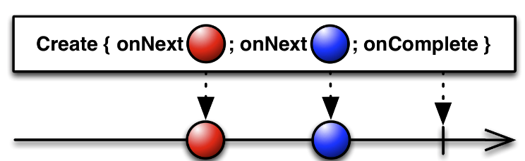
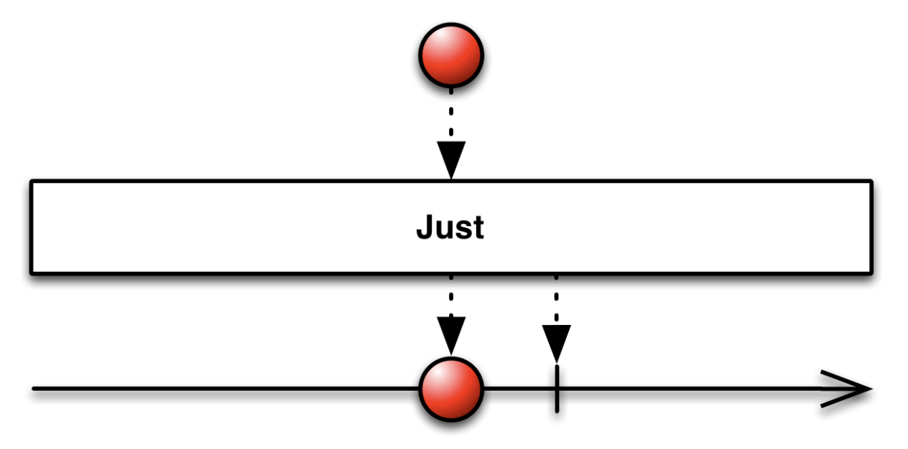
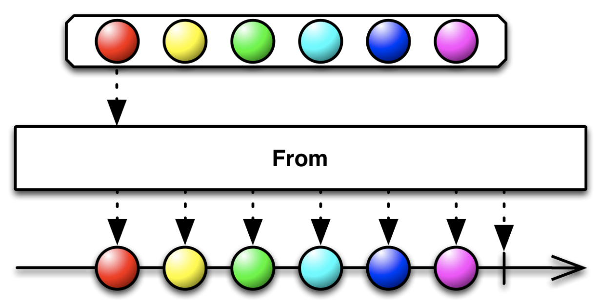

## 2.  Observable(1)

RxJava에서는 Observable을 구독(subscribe) 하는 Observer가 존재하고, Observable 이 순차적으로 발행하는 데이터에 대해서 반응

Observable 은 다음과 같은 이벤트를 사용하여 동작한다.

- `onNext()` : 하나의 소스 Observable에서 Observer까지 한 번에 하나씩 순차적으로 데이터를 발행
- `onComplete()` : 데이터 발행이 끝났음을 알리는 완료 이벤트를 Observer에 전다랗여 더는 `onNext()` 호출이 발생하지 않음을 나타냄
- `onError()` : 오류가 발생했음을 Observer에 전달

위와 같은 이벤트 메서드들은 Emitter라는 인터페이스에 선언. 

데이터 및 오류 내용을 발행할 때 null 을 발행할 수 없음을 주의


### **Observable 생성하기**

RxJava에서는 연산자라고 부르는 여러 정적 메서드를 통해 기존 데이터를 참조하거나 변형하여 Observable 을 생성할 수도 있음.

수백 개의 연산자를 제공하며, 이 책에서는 자주 쓰이는 몇 가지 연산들에 대해서만 다룬다.


#### **create()**



> create() 연산자 마블 다이어그램 [이미지 출처 : reactivex.io](http://reactivex.io/documentation/operators/create.html)

`Observable.create()`를 사용하면 Emitter를 이용하여 직접 아이템을 발행하고, 아이템 발행의 완료 및 오류의 알림을 직접 설정 가능하다.

```kotlin
@Test
fun observableOperator() {
    val source = Observable.create<String> { emitter ->
        emitter.onNext("Hello")
        emitter.onNext("World")
        emitter.onComplete()
    }

    //Consumer를 통해 구독하기
    source.subscribe(System.out::println)
  /*
  *결과
  *Hello
	*World
	*/
}
```

emitter를 통해 문자열들을 발행했다.

Observable을 구독하도록 `subscribe()` 메서드를 호출하여 Observer 또는 Consumer를 추가할 수 있다. 아이템의 발행이 끝났다면 반드시 `onComplete()` 를 호출해야함. `onComplete()` 호출 후 에는 아이템이 추가로 발행하더라고 구독자는 데이터를 통지받지 못한다.

```kotlin
@Test
fun observableOperator() {
    val source = Observable.create<String> { emitter ->
        emitter.onNext("Hello")
        emitter.onComplete()
        emitter.onNext("World")
    }
    source.subscribe(System.out::println)
  /*
  *결과
  *Hello
	*/
}
```


만약 오류가 발생했을 시에는 Emitter를 통해 `onError(Throwable)` 를 호출해야 하며, 구독자는 이를 적절히 처리해야만 한다.

```kotlin
val source = Observable.create<String> { emitter ->
    emitter.onNext("Hello")
    emitter.onError(Throwable())
    emitter.onNext("World")
}

source.subscribe(
     (System.out::println) ,
    { _ -> println("Error!!") })
    
    
/* 결과
*Hello
*Error!!
*/
```


실제로는 `create()` 연산자는 개발자가 직접 Emitter를 제어하므로 주의하여 사용해야한다. 예시로 Observable이 폐기 되었을 때 등록된 콜백을 모두 해제하지 않으면 메모리 누수가 발생하고, BackPressure(배압)를 직접 처리해야한다.


#### **just()**



> just() 연산자 마블 다이어그램 [이미지 출처 : reactive.io](http://reactivex.io/documentation/operators/just.html)

해당 아이템을 그대로 발행하는 Observable을 생성해 준다. `just()` 연산자의 인자로 넣은 아이템을 차례로 발행하며, 한개의 아이템을 넣을 수도 있고, 타입이 같은 여러개의 아티엠을 넣을 수도 있다.

```kotlin
val source2 = Observable.just("Hello", "World")
source2.subscribe(System.out::println)
/* 결과
Hello
World
 */
```

RxJava에서는 기본적으로 null 을 허용하지 않아, just의 인자로 null 을 넣어서는 안됨(오류 발생). 만일 빈 Observable을 만들고 싶다면 `Observable.empty()` 연산자를 사용한다.


### **간단히 Observable 로 변환하기**

이미 참조할 수 있는 배열 및 리스트 등의 자료구조나 Future, Callable 또는 Publisher 가 있다면 from으로 시작하는 연산자를 통해 Observable로 변환할 수 있다.



> from 연산자 마블 다이어그램 [이미지 출처 : reactivex.io](http://reactivex.io/documentation/operators/from.html)

| 연산자 이름     | 설명                                                         |
| --------------- | ------------------------------------------------------------ |
| fromArray()     | 배열을 ObservableSource로 변환하여 아이템을 순차적으로 발행  |
| fromIterable()  | ArrayList, HashSet처럼 Iteravle을 구현한 모든 객체를 ObservableSource로 변환하여 아이템을 순차적으로 발행 |
| fromFuture()    | Future 인터 페이스를 지원하는 모든 객체를 ObservableSource로 변환하고 Future.get() 메서드를 호출한 값을 반환 |
| fromPublisher() | Publisher를 Observable 로 변환                               |
| fromCallable()  | Callable을 Observable 로 변환                                |


#### **fromArray()**

가지고 있는 아이템들이 배열일 경우에는 fromArray() 연산자를 이용하여 아이템을 순차적으로 발행할 수 있다.

```kotlin
val itemArray = arrayOf("A", "B", "C")
val source3 = Observable.fromArray(itemArray)
source3.subscribe { items ->
    for(item in items){
        println(item)
    }
}
/* 결과
A
B
C
*/
```


#### **fromIterable()**

ArrayList, HashSet 등과 같이 일반적으로 Iterable을 구현한 자료 구조 클래스는 `fromIterable()` 연산자를 통해 쉽게 Observable로 변환이 가능함. 

```kotlin
val itemList = arrayListOf("A", "B", "C")
val source4 = Observable.fromIterable(itemList)
source4.subscribe(System.out::println)
/*결과
A
B
C
 */
```


#### **fromFuture()**

- Future 인터페이스는 비동기적인 작업의 결과를 구할 때 사용. 

- 보통 Executor Service를 통해 비동기적인 작업을 할 때 사용. 

- Future 또한 `fromFuture()` 연산자를 통해 Observable로 변경이 가능.
- Emitter 는 Observable 내부에서 `Futrue.get()` 메서드를 호출하고, Future의 작업이 끝나기 전까지 스레드는 블로킹 됨

```kotlin
val future = Executors.newSingleThreadExecutor()
    .submit<String> {
        Thread.sleep(5000)
        "Hello World"
    }
Observable.fromFuture(future).apply {
    subscribe(System.out::println)
}
/*
결과
Hello World
(5초 후 나타남)
 */
```

RxJava 에서는 Executor를 직접 다루기 보다는 RxJava에서 제공하는 스케줄러를 사용하는 것을 권장


#### **fromPublisher()**

Publisher는 잠재적인 아이템 발행을 제공하는 생산자로 Subscriber 로부터 요청을 받아 아이템을 발행

`fromPublisher()` 연산자를 통해 Publisher를 Observable로 다음과 같이 변환 가능

```kotlin
val publisher = Publisher<String> {
    it.onNext("A")
    it.onNext("B")
    it.onNext("C")
    it.onComplete()
}
Observable.fromPublisher(publisher).apply {
    subscribe(System.out::println)
}
/*
결과
A
B
C
 */
```


#### **fromCallable()**

Callable 인터페이스는 비동기적인 실행 결과를 반환한다는 점이 Runnable과 다름

`fromCallable()` 연산자를 통해 Callable을 Observable로 변환하고, 비동기적으로 아이템을 발행할 수 있음

```kotlin
val callable = Callable<String>(){
    return@Callable "Hello World"
}
Observable.fromCallable(callable).apply {
    subscribe(System.out::println)
}
/*
결과
Hello World
 */
```

