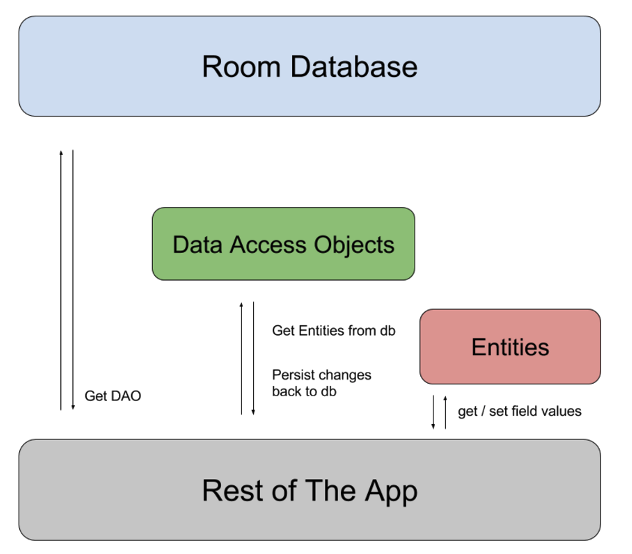

## [**5.Room**](https://developer.android.com/training/data-storage/room)

SQLite에 대한 추상화 계층을 제공하여 SQLite의 모든 기능을 활용하면서 쉬운 Database 액세스를 허용한다.

<br>

<br>



> Room Architecture Diagram 출처 : https://developer.android.com/training/data-storage/room

<br>

### **구성요소**

- **데이터베이스 (Database)** : 애플리케이션에서 영구적, 관계형 데이터에 대한 기본 연결을 위한 주요 진입점을 제공, 데이터베이스 홀더를 포함함
  - 만드는 조건
    - RoomDatabase를 상속한 추상 클래스에 `@Database` 애노테이션을 추가
    - 데이터베이스에 포함할 엔티티의 목록을 애노테이션 내에 포함해야함
    - 매개 변수를 갖지 않고, `@Dao` 클래스를 반환하는 추상 메서드를 포함

런 타임에 `Room.databaseBuilder()` 또는 `Room.inMemoryDatabaseBuilder()` 호출을 통해 Database 인스턴스를 얻을 수 있음

<br>

- **엔티티 (Entity**) : 데이터베이스의 테이블을 표현. POJO 클래스에 `@Entity` 애노테이션을 추가하는 것으로, 생성하고 이를 `@Database` 애노테이션에 추가할 수 있음

<br>

- **DAO (Data Access Obejct)** : `@Dao` 애노테이션을 인터페이스에 사용하며, 데이터베이스에 접근하려고 사용되는 추상 메서드를 포함

<br>

> 전반적인 흐름

앱은 Room 데이터베이스를 사용하여 DAO를 가져옴. 

DAO를 사용하여 데이터베이스에서 엔티티를 가져오고, 해당 엔티티에 대한 변경 내용을 데이터베이스에 다시 저장

앱은 엔티티를 사용하여 데이터베이스 내 테이블 칼럼에 해당하는 값을 가져오고 설정한다.

<br>

<br>

### **컴파일러 옵션 설정하기**

Room 은 다음과 같은 애노테이션 프로세서 옵션을 가짐

- **room.schemaLocation** : 데이터베이스 스키마를 JSON 파일 형태로 추출하고, 이를 저장할 디렉터리를 설정

<br>

- **room.incremental** : 그레이들에서 증분 애노테이션 프로세서를 활성화

<br>

- **room.expandProjection** : DAO 클래스 내 메서드에 스타 프로젝션(*) 사용 시 메서드 반환 타입이 가진 필드만 포함하도록 쿼리를 다시 작성, 필요한 열만 쿼리하므로 비용이 줄고 `CURSOR_MISMATCH` 경고 메시지를 근본적으로 없앨 수 있음

<br>

```groovy
android{
	...
    defaultConfig{
      ...
        javaCompileOptions{
          annotationProcessorOptions{
            arguments = [
              "room.schemaLocation" : "$projectDir/schemas".toString(),
              "room.incremental" : "true",
              "room.expandProjection" : "true"
            ]
          }
        }
    }
}
```

<br>

### **엔티티 정의하기**

`@Entity` 애노테이션을 클래스에 붙이고, 필드를 선언하면 정의할 수 있음

`@Database` 의 entities로 추가된 각 엔티티 클래스들은 데이터 베이스 인스턴스가 생성될 때 테이블로 생성됨

```kotlin
@Entity
data class User{
  @PrimaryKey val id:Int,
  val firstName : String,
  val lastName : String
}
```

<br>

**기본키 사용하기**

반드시 최소한 한개의 필드를 `@PrimaryKey` 애노테이션 사용과 함께 기본키로 선언해야하며, 필드가 하나 뿐이여도 필요하다.

ID를 자동으로 생성하게 하고 시다면 `@PrimaryKey` 의 autoGenerate 속성을 사용

만약 복합키를 갖는다면 `primaryKeys` 속성 사용가능

```kotlin
@Entity(primaryKeys = ["firstName", "lastName"])
data class User{
  val firstName : String,
  val lastName : String
}
```

<br>

기본적으로 엔티티 클래스 이름을 DB 내의 테이블 이름으로 사용하지만,  tableNmae 속성을 이용하여 이름 설정 가능

칼럼 이름 역시 따로 설정하고 싶다면 `@ColumnInfo` 애노테이션을 필드에 추가하면 된다. (SQLite 에서는 테이블 이름의 대소문자 구분 x)

```kotlin
@Entity(tableName = "users")
data class User{
  @PrimaryKey val id:Int,
	@ColumnInfo(name = "first_name") val firstName : String,
  val lastName : String
}
```

<br>

**필드 무시하기**

만약 엔티티의 필드를 테이블의 칼럼으로 만들고 싶지 않다면 필드에 `@Ignore` 를 다음과 같이 사용가능

```kotlin
@Entity(tableName = "users")
data class User{
  @PrimaryKey val id:Int,
	@ColumnInfo(name = "first_name") val firstName : String,
  val lastName : String,
  @Ignore  val picture:Bitmap
}
```

혹은 `@Entity` 의 속성`인 ignoredColumn` 에 필드명을 추가하여 사용도 가능하다.`

```kotlin
@Entity(tableName = "users", ignoredColumns = ["picture"])
data class User{
  @PrimaryKey val id:Int,
	@ColumnInfo(name = "first_name") val firstName : String,
  val lastName : String,
	val picture:Bitmap
}
```

<br>

<br>

### **객체 간 관계 정의하기**

SQLite는 관계형 데이터베이스이므로 객체 간 관계를 지정할 수 있음.

대부분의 객체 관계형 매핑 라이브러리에서 **엔티티 객체가 서로 참조하는 것**을 허용하는 반면에 **Room 은 이를 명시적으로 금지**

<br>

**일 대 다 관계 정의**

직접적인 관계를 사용할 수는 없지만 Room에서는 엔티티간 외래키 제약조건을 정의할 수 있음

`@ForeginKey ` 애노테이션을 사용하여 관계 정의 가능

```kotlin
@Entity(
  foreinsKeys =[ForeignKey(
    entity = User::class,
    parentColumns = arrayOf("id"),
    childColumns = arrayOf("user_id")
  )]
)
data class Book{
  @PrimaryKey val bookId : Int,
  val title : String,
  @ColumnInfo(name="user_id") val userId:Int
}
```

user_id 외래키를 통해 0개 이상의 Book 인스턴스가 하나의 User 인스턴스에 연결 될 수 있으므로 User와 Book 사이에 일 대 다 관계를 모델링함.

<br><br>

### **내장된 객체 생성하기**

객체에 여러 필드가 포함되어도, 엔티티 또는 데이터 객체를 데이터베이스로직에서 전체적으로 표현하려는 경우 `@Embeded` 애노테이션을 사용하여

테이블 내 서브 필드로 분해하는 오브젝트로 표현할 수 있다.

```kotlin
data class Address{
  val street:String,
  val state:String,
  val city:String,
  @ColumnInfo(name="post_code") val postCode:Int
}

@Entity
data class User{
  @PrimaryKey val id:Int,
  val firstName:String,
  @Embeded val address:Address
}
```

`@Embeded` 필드에 또 다른 `@Embeded` 객체 포함가능

동일한 타입의 `@Embeded` 필드가 여러개 있는 경우 prefix 속성을 설정하여 각 칼럼을 고유하게 유지할 수 있음

<br>

<br>

### **데이터베이스에 뷰 만들기**

Room 라이브러리 버전 2.1.0 이상은 SQLite 데이터베이스 뷰(View) 를 지원하므로 쿼리를 클래스로 캡슐화 가능

Room 은 이러한 쿼리 지원 클래스를 뷰라고 하며 DAO 에서 사용될 떄 간단한 데이터 개체와 동일하게 동작

뷰에 대해서 SELECT 문은 실행 가능하나 INSERT, UPDATE, DELETE 문은 실행 불가

<br>

**뷰 생성하기**

`@DatabaseView`  애노테이션을 클래스에 추가하고, 애노테이션의 값을 클래스가 나타내야하는 쿼리로 설정

```kotlin
@DatabaseView("SELECT user.id, user.name, user.departmendId," +
             "department.name AS departmentName FROM user " +
             "INNER JOIN department ON user.departmentId = department.id")
data class UserDetail{
  val id:Long,
  val name:String,
  val departmentId:Long,
  val departmentName:String
}
```

<br>

**데이터베이스테 뷰 포함하기**

뷰를 앱 데이터베이스의 일부로 포함하려면 `@Database` 애노테이션 views 속성을 다음과 같이 정의

```kotlin
@Database(
  entitis =[User::class],
  views =[UserDetail::class],
  version = 1
)
abstract class AppDatabase : RoomDatabase(){
  abstract fun userAdo():UserDao
}
```

<br>

---

