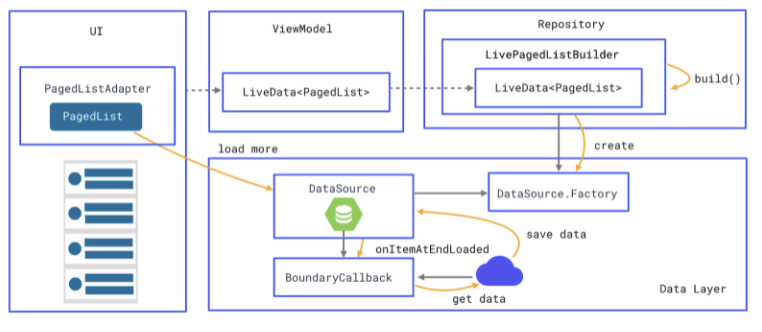
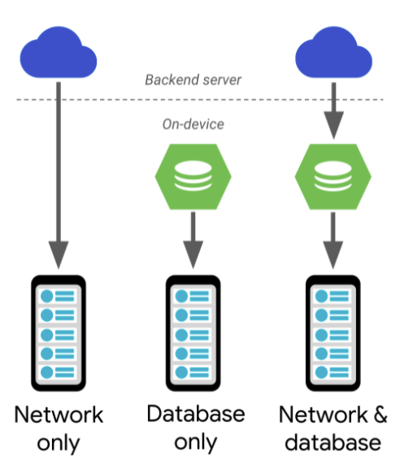

# [6.Paging](https://developer.android.com/topic/libraries/architecture/paging)

데이터를 작게 나누어 로드하는데 적합한 라이브러리. 데이터를 필요한 만큼만 로드하면 시스템 자원과 네트워크 대역폭의 사용을 줄일 수 있다.

> Paging Component Workflow



DataSource로 부터 얻은 데이터를 PageList 형태로 관리하고, PagedListAdapter를 통해 최종적으로 RecyclerView에 표현

<br>

### **페이징 컴포넌트 프로젝트에 추가하기**

> build.gradle(app)

```groovy
dependencies {
  def paging_version = "2.1.2"

  implementation "androidx.paging:paging-runtime:$paging_version" 
  // For Kotlin use paging-runtime-ktx

  // alternatively - without Android dependencies for testing
  testImplementation "androidx.paging:paging-common:$paging_version" 
  // For Kotlin use paging-common-ktx

  // optional - RxJava support
  implementation "androidx.paging:paging-rxjava2:$paging_version" 
  // For Kotlin use paging-rxjava2-ktx
}
```

<br>

<br>

### **다양한 데이터 구조 지원**

> Paging Component use case



<br>

페이징 라이브러리는 다음과 같은 데이터 구조를 갖는 모델을 타깃으로 설계됨

- 네트워크로부터 데이터 가져오기
- 로컬 데이터베이스로부터 데이터 가져오기
- 네트워크에서 얻은 데이터를 로컬 데이터베이스에 캐싱하여 사용하기

<br>

서버 또는 로컬 데이터베이스 전용 구조로만 사용하는 경우 가져온 데이터가 앱의 UI 모델로 직접 연결된다.

서버로 부터 얻은 데이터를 로컬 데이터베이스에 캐싱하여 사용하는 경우 서버에서 얻은 데이터를 로컬에 먼저 저장, 로컬은 앱의 UI 모델과 연결 되어 나타남.

<br>

데이터를 작게 나누어 로드하는 페이징 라이브러리는 얻은 데이터의 마지막 지점에 도달하면 더 많은 데이터를 요청한다.

<br>

<br>

### **페이징 컴포넌트의 구성 요소**

구성요소로는 DataSource와 PagedList가 존재한다.

#### **DataSource**

데이터를 작게 나누어 불러온 다음 PagedList로 로드하는 기본 클래스. 더 많은 데이터를 로드할 수록 PagedList가 커지며, 로드된 데이터는 갱신할 수 없다. 데이터의 변경사항이 발생하면 새로운 PagedList와 DataSource를 생성해야한다.

데이터를 이어서 불러들일 수 없는 상황이면 `invaildate()` 를 호출하여 새로운 PagedList와 DataSource 가 새로운 상태로부터 데이터를 로드한다.

<br>

#### **DataSource.Factory**

DataSource 인스턴스를 만들어 제공하는 팩토리 클래스

`create()` 메서드에서 DataSource를 반환하며, 데이터 세트가 무효화될 때마다 `create()` 메서드에서 새로운 DataSource 객체를 만들 수 있다.

<br>

#### **PagedList**

DataSource에서 변경 불가능한 콘텐츠의 페이지를 지연 로드 목록으로 표시, DataSource에서 페이징 된 데이터를 관리하는 리스트.

메소드를 이용해 아이템에 접근할 수 있도, 추가 로드를 트리거할 수 있다.

<br>

#### **LivePagedListBuilder**

DataSource.Factory 와 PagedList.Config를 생성자 매개 변수로 가지며, `LiveData<PagedList>` 를 만드는 빌더 클래스

선택적으로 초기 로드 키 또는 BoundaryCallback 등을 구성 및 활성화 하여 빌드할 수 있다.

<br>

#### **PagedListAdapter**

PagedList에서 페이징 된 데이터를 표시하는 RecyclerView.Adapter 기반의 클래스

아이템 카운트를 계산하고, 상태 변화를 체크하는 일반적인 동작에 대한 구현을 담당하는 AsyncPagedListDiffer 객체를 내부에 가지고 있고, 새로운 목록 사용이 가능할 때 `submitList(PagedList)` 메서드를 호출할 수 있다.

<br>

구현시 주의사항은 새로운 PagedList에 대한 백그라운드 계산을 위해 **DiffUtil.ItemCallback**을 필수적으로 구현해야한다.

<br>

<br>

<br>

## **DataSource 종류 선택하기**

#### 해당 부분은 스스로 공부할 때 정리한 개인 블로그 주소를 참조한다.

- 블로그 주소 : https://jjjoonngg.github.io/aac/AAC-Paging/#datasource

<br>

<br>

<br>

### **로컬 데이터베이스 페이징 구현 예제**

Room에서는 Integer 타입을 키로 갖는 DataSource.Factory를 지원한다.

```kotlin
@Dao
interface UserDao {
    @Query("SELECT * FROM User")
    fun getUsers(): DataSource.Factory<Int, User>
}
```

<br>

반환형을 `DataSource.Factory<Integer, Object>` 로 지정하는 경우, Room 은 컴파일 타임에 PositionalDataSource 객체를 제공하는 팩토리 코드를 컴파일 타임에 생성한다. 만약 다른 타입을 생성하고 싶다면, 직접 DatsSource 서브클래스를 만들어야한다.

<br>

> ViewModel로부터 LivePagedListBuilder 를 통해 PagedList를 생성하는 예제

```kotlin
class UserViewModel(userDao: UserDao) : ViewModel() {
    val users: LiveData<PagedList<User>> =
  								userDao.getUsers().toLiveData(pageSize=10)
}
```

> Adapter 구현

```kotlin
class UserAdapter() :
        PagedListAdapter<User, ViewHolder>(DIFF_CALLBACK) {
    fun onBindViewHolder(holder: ViewHolder, position: Int) {
        ...
    }

    companion object {
        private val DIFF_CALLBACK = object :
                DiffUtil.ItemCallback<User>() {
                  ...
                }
    }
}
```

PagedListAdapter는 데이터가 무효가 되었을 때 새로운 데이터와 이전 데이터를 비교하여 자연스러운 효과 연출을 위해 `DiffUtil.ItemCallback` 을 반드시 구현해야한다.

> 데이터와 뷰의 연결을 UI 컨트롤러를 통해 진행

```kotlin
class UserActivity : AppCompatActivity() {
    public override fun onCreate(savedInstanceState: Bundle?) {
        super.onCreate(savedInstanceState)
        val viewModel: UserViewModel by viewModels()
        val recyclerView = findViewById(R.id.user_list)
        val adapter = UservAdapter()
        viewModel.users.observe(this, PagedList(adapter::submitList))
        recyclerView.setAdapter(adapter)
    }
}
```

ViewModel에 있는 사용자 목록 LiveData를 구독하고 데이터가 발행 되었을 때 PagedList Adapter의 `submitList` 메서드를 통해 사용자 목록 데이터를 전달할 수 있다.

<br>

<br>

### **네트워크 페이징 구현 예제**

> https://jsonplaceholder.typicode.com 에서 제공하는 더미데이터를 사용한 예제

<br>

> Retrofit 을 사용하여 데이터 불러오는 예제 

```kotlin
interface PostService{
  @GET("posts")
  fun getPost(@Query("_page") page:Int):Call<List<Post>>
  
  @GET("posts?_page=1")
  fun getTopPosts():Call<List<Post>>
}
```

<br>

> PostService 를 이용한 DataSource

```kotlin
class PostDataSource : PagedKeyedDataSource<Int, Post>{
 	private lateinit	var postService:PostService
  
 	fun init(postService:PostService){
    this.postService = postService
  }
  
  fun loadInitial(
    params:LoadInitialParams<Int>, callback:LoadInitialCallback<Int, Post>
  ){
    val requset:Call<List<Post>> = postService.getTopPosts()
    
    try{
      val response:Response<List<Post>> = request.execute()
      val items:List<Post> = response.body()
      val nextPage:Int = getNextPage(response)
      callback.onResult(items, null, nextPage)
    }catch(e:IOException){
      e.printStackTrace()
    }
  }
  
  
  override fun loadBefore(
    params:LoadParama<Int>, callback:LoadCallback<Int, Post>
  ){
    //do Nothing
  }
  
  override fun loadAfter(
    params:LoadParama<Int>, callback:LoadCallback<Int, Post>
  ){
    val request:Call<List<Post>> = postService.getPosts(params.key)
    
    try{
      val response:Response<List<Post>> = request.execute()
      val items:List<Post> = response.body()
      val nextPage:Int = getNextPage(response)
      callback.onResult(items, nextPage)
    }catch(e:IOException){
      e.printStackTrace()
    }
  }
  
  private fun getNextPage(response:Response<List<Post>>):Int{
    ...
  }
}
```

`loadInitial()` 메서드로부터 초기 데이터를 로드 및 이전, 다음 페이지 키를 지정

사용자 스크롤에 맞춰 `loadBefore()` or `loadAfter()` 가 호출되는데 쵝 데이터를 불러올 떄와 마찬가지로, 키를 지정해야함

<br>

> PostDataSource 를 생성하는 팩토리 클래스

```kotlin
class PostDataSourceFactory:DataSource.Factory<Int, Post>{
 	private lateinit	var postService:PostService
  
 	fun init(postService:PostService){
    this.postService = postService
  }
  
  override fun create():DataSource<Int, Post>= PostDataSource(postService)
}
```

<br>

<br>

---


